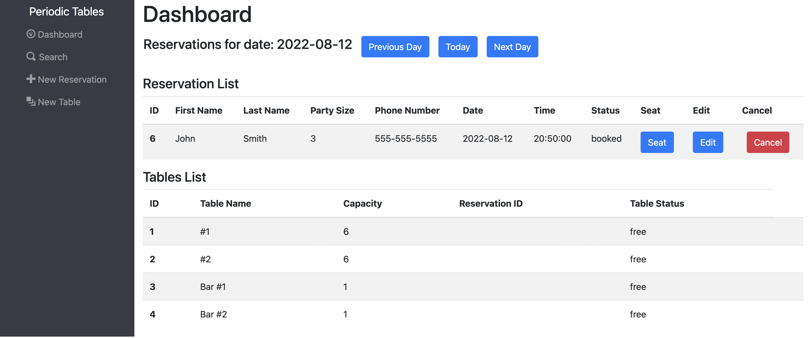
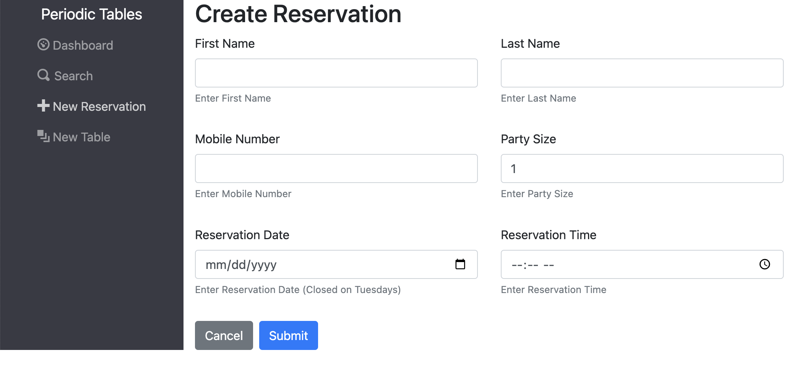
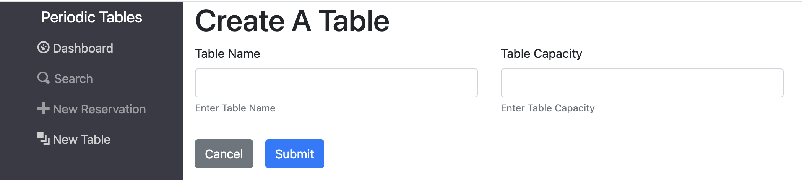
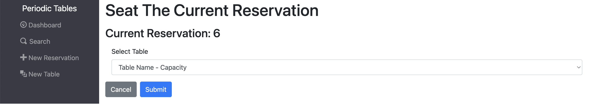
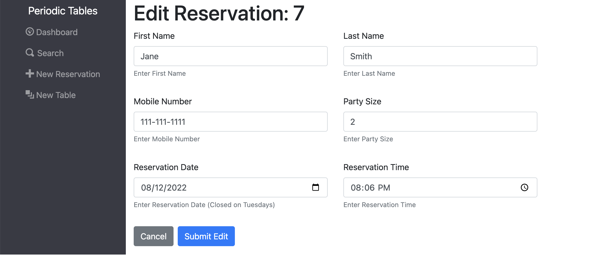

# Capstone: Restaurant Reservation System

Capstone Summary: You have been hired as a full stack developer at _Periodic Tables_, a startup that is creating a reservation system for fine dining restaurants.
The software is used only by restaurant personnel when a customer calls to request a reservation.
The restaurant can create and view available tables, create and assign reservations, and search for reservations.

At this point, customers will not access the system online.

## Live Application Link
- https://capstone-client-ks.herokuapp.com/dashboard

## Routes
- `/dashboard` - Defaults to current day, shows all reservations for the selected day and restaurant tables.

- `/reservations/new` - Create a new reservation for a party.

- `/tables/new` - Create a new table to seat guests at.

- `/reservations/:reservationId/seat` - Select which table to seat the reservation at.

- `/reservations/:reservationId/edit` - Edit the selected reservation.

- `/search` - Search for a reservation by customer's phone number.

## Technology Used
Full-stack app using React.js, CSS, Node.js, Express, and PostgreSQL

## Installation Instructions

### Database setup

1. Set up four new ElephantSQL database instances - development, test, preview, and production.
1. After setting up your database instances, connect DBeaver to your new database instances.

#### Knex

Run `npx knex` commands from within the `back-end` folder, which is where the `knexfile.js` file is located.

### Installation

1. Fork and clone this repository.
1. Run `cp ./back-end/.env.sample ./back-end/.env`.
1. Update the `./back-end/.env` file with the connection URL's to your ElephantSQL database instance.
1. Run `cp ./front-end/.env.sample ./front-end/.env`.
1. You should not need to make changes to the `./front-end/.env` file unless you want to connect to a backend at a location other than `http://localhost:5001`.
1. Run `npm install` to install project dependencies.
1. Run `npm run start:dev` to start your server in development mode.

### Running tests

This project has unit, integration, and end-to-end (e2e) tests. You can run all the tests using the following commands:

- `npm test` runs _all_ tests.
- `npm run test:backend` runs _all_ backend tests.
- `npm run test:frontend` runs _all_ frontend tests.
- `npm run test:e2e` runs only the end-to-end tests.

Note that the logging level for the backend is set to `warn` when running tests and `info` otherwise.

> **Note**: After running `npm test`, `npm run test:X`, or `npm run test:e2e` you might see something like the following in the output: `[start:frontend] Assertion failed:`. This is not a failure, it is just the frontend project getting shutdown automatically.

> **Note**: If you are getting a `unable to resolve dependency tree` error when running the frontend tests, run the following command: `npm install --force --prefix front-end`. This will allow you to run the frontend tests.

> If you stop the tests before they finish, it can leave the test database in an unusual state causing the tests to fail unexpectedly the next time you run them. If this happens, delete all tables in the test database, including the `knex_*` tables, and try the tests again.

### User Story Summaries

#### US-01 Create and list reservations

As a restaurant manager 
I want to create a new reservation when a customer calls 
so that I know how many customers will arrive at the restaurant on a given day.

##### Acceptance Criteria

1. The `/reservations/new` page will
   - have the following required and not-nullable fields:
     - First name: `<input name="first_name" />`
     - Last name: `<input name="last_name" />`
     - Mobile number: `<input name="mobile_number" />`
     - Date of reservation: `<input name="reservation_date" />`
     - Time of reservation: `<input name="reservation_time" />`
     - Number of people in the party, which must be at least 1 person. `<input name="people" />`
   - display a `Submit` button that, when clicked, saves the new reservation, then displays the `/dashboard` page for the date of the new reservation
   - display a `Cancel` button that, when clicked, returns the user to the previous page
   - display any error messages returned from the API
1. The `/dashboard` page will
   - list all reservations for one date only. (E.g. if the URL is `/dashboard?date=2035-12-30` then send a GET to `/reservations?date=2035-12-30` to list the reservations for that date). The date is defaulted to today, and the reservations are sorted by time.
   - display next, previous, and today buttons that allow the user to see reservations on other dates
   - display any error messages returned from the API
1. The `/reservations` API will have the same validations as above and will return 400, along with an informative error message, when a validation error happens.
   - seed the reservations table with the data contained in `./back-end/src/db/seeds/00-reservations.json`

#### US-02 Create reservation on a future, working date

As a restaurant manager 
I only want to allow reservations to be created on a day when we are open 
so that users do not accidentally create a reservation for days when we are closed. 

##### Acceptance criteria

1. The `/reservations/new` page will display an error message with `className="alert alert-danger"` if any of the following constraints are violated:
   - The reservation date is a Tuesday as the restaurant is closed on Tuesdays.
   - The reservation date is in the past. Only future reservations are allowed.
1. The `/reservations` API will have the same validations as above and will return 400, along with an informative error message, when a validation error happens.

#### US-03 Create reservation within eligible timeframe

As a restaurant manager 
I only want to allow reservations to be created during business hours, up to 60 minutes before closing 
so that users do not accidentally create a reservation for a time we cannot accommodate.

##### Acceptance criteria

1. The `/reservations/new` page will display an error message with `className="alert alert-danger"`, if any of the following additional constraints are violated:
   - The reservation time is before 10:30 AM.
   - The reservation time is after 9:30 PM, because the restaurant closes at 10:30 PM and the customer needs to have time to enjoy their meal.
   - The reservation date and time combination is in the past. Only future reservations are allowed. E.g., if it is noon, only allow reservations starting _after_ noon today.
1. The `/reservations` API will have the same validations as above and will return 400, along with an informative error message, when a validation error happens.

#### US-04 Seat reservation

As a restaurant manager,  
When a customer with an existing reservation arrives at the restaurant 
I want to seat (assign) their reservation to a specific table 
so that I know which tables are occupied and free.

##### Acceptance Criteria

1. The `/tables/new` page will
   - have the following required and not-nullable fields:
     - Table name: `<input name="table_name" />`, which must be at least 2 characters long.
     - Capacity: `<input name="capacity" />`, this is the number of people that can be seated at the table, which must be at least 1 person.
   - display a `Submit` button that, when clicked, saves the new table then displays the `/dashboard` page
   - display a `Cancel` button that, when clicked, returns the user to the previous page
1. The `/dashboard` page will:

   - display a list of all reservations in one area.
   - each reservation in the list will:
     - Display a "Seat" button on each reservation.
     - The "Seat" button must be a link with an `href` attribute that equals `/reservations/${reservation_id}/seat`, so it can be found by the tests.
   - display a list of all tables, sorted by `table_name`, in another area of the dashboard
     - Each table will display "Free" or "Occupied" depending on whether a reservation is seated at the table.
     - The "Free" or "Occupied" text must have a `data-table-id-status=${table.table_id}` attribute, so it can be found by the tests.

1. The `/reservations/:reservation_id/seat` page will
   - have the following required and not-nullable fields:
     - Table number: `<select name="table_id" />`. The text of each option must be `{table.table_name} - {table.capacity}` so the tests can find the options.
   - do not seat a reservation with more people than the capacity of the table
   - display a `Submit` button that, when clicked, assigns the table to the reservation then displays the `/dashboard` page
   - PUT to `/tables/:table_id/seat/` in order to save the table assignment. The body of the request must be `{ data: { reservation_id: x } }` where X is the reservation_id of the reservation being seated. The tests do not check the body returned by this request.
   - display a `Cancel` button that, when clicked, returns the user to the previous page
1. The `tables` table must be seeded with the following data:
   - `Bar #1` & `Bar #2`, each with a capacity of 1.
   - `#1` & `#2`, each with a capacity of 6.
1. The `/tables` API will have the same validations as above and will return 400, along with an informative error message, when a validation error happens.

- if the table capacity is less than the number of people in the reservation, return 400 with an error message.
- if the table is occupied, return 400 with an error message.

#### US-05 Finish an occupied table

As a restaurant manager 
I want to free up an occupied table when the guests leave 
so that I can seat new guests at that table. 

##### Acceptance Criteria

1. The `/dashboard` page will
   - Display a "Finish" button on each _occupied_ table.
   - the "Finish" button must have a `data-table-id-finish={table.table_id}` attribute, so it can be found by the tests.
   - Clicking the "Finish" button will display the following confirmation: "Is this table ready to seat new guests? This cannot be undone." If the user selects "Ok" the system will: - Send a `DELETE` request to `/tables/:table_id/seat` in order to remove the table assignment. The tests do not check the body returned by this request. - The server should return 400 if the table is not occupied. - Refresh the list of tables to show that the table is now available.
   - Clicking the "Cancel" makes no changes.

#### US-06 Reservation Status

As a restaurant manager 
I want a reservation to have a status of either booked, seated, or finished 
so that I can see which reservation parties are seated, and finished reservations are hidden from the dashboard.

##### Acceptance Criteria

1. The `/dashboard` page will
   - display the status of the reservation. The default status is "booked"
     - the status text must have a `data-reservation-id-status={reservation.reservation_id}` attribute, so it can be found by the tests.
   - display the Seat button only when the reservation status is "booked".
   - clicking the Seat button changes the status to "seated" and hides the Seat button.
   - clicking the Finish button associated with the table changes the reservation status to "finished" and removes the reservation from the dashboard.
   - to set the status, PUT to `/reservations/:reservation_id/status` with a body of `{data: { status: "<new-status>" } }` where `<new-status>` is one of booked, seated, or finished. Please note that this is only tested in the back-end for now.

#### US-07 Search for a reservation by phone number

As a restaurant manager 
I want to search for a reservation by phone number (partial or complete) 
so that I can quickly access a customer's reservation when they call about their reservation. 

##### Acceptance Criteria

1. The `/search` page will
   - Display a search box `<input name="mobile_number" />` that displays the placeholder text: "Enter a customer's phone number"
   - Display a "Find" button next to the search box.
   - Clicking on the "Find" button will submit a request to the server (e.g. GET `/reservations?mobile_number=800-555-1212`).
     - then the system will look for the reservation(s) in the database and display all matched records on the `/search` page using the same reservations list component as the `/dashboard` page.
     - the search page will display all reservations matching the phone number, regardless of status.
   - display `No reservations found` if there are no records found after clicking the Find button.

#### US-08 Change an existing reservation

As a restaurant manager 
I want to be able to modify a reservation if a customer calls to change or cancel their reservation 
so that reservations are accurate and current.

##### Acceptance Criteria

1. The `/dashboard` and the `/search` page will
   - Display an "Edit" button next to each reservation
     - Clicking the "Edit" button will navigate the user to the `/reservations/:reservation_id/edit` page
   - the "Edit" button must be a link with an `href` attribute that equals `/reservations/${reservation_id}/edit`, so it can be found by the tests.
   - Display a "Cancel" button next to each reservation
   - The Cancel button must have a `data-reservation-id-cancel={reservation.reservation_id}` attribute, so it can be found by the tests.
   - Clicking the "Cancel" button will display the following confirmation: "Do you want to cancel this reservation? This cannot be undone."
     - Clicking "Ok" on the confirmation dialog, sets the reservation status to `cancelled`, and the results on the page are refreshed.
       - set the status of the reservation to `cancelled` using a PUT to `/reservations/:reservation_id/status` with a body of `{data: { status: "cancelled" } }`.
     - Clicking "Cancel" on the confirmation dialog makes no changes.
1. The `/reservations/:reservation_id/edit` page will display the reservation form with the existing reservation data filled in
   - Only reservations with a status of "booked" can be edited.
   - Clicking the "Submit" button will save the reservation, then displays the previous page.
   - Clicking "Cancel" makes no changes, then display the previous page.
